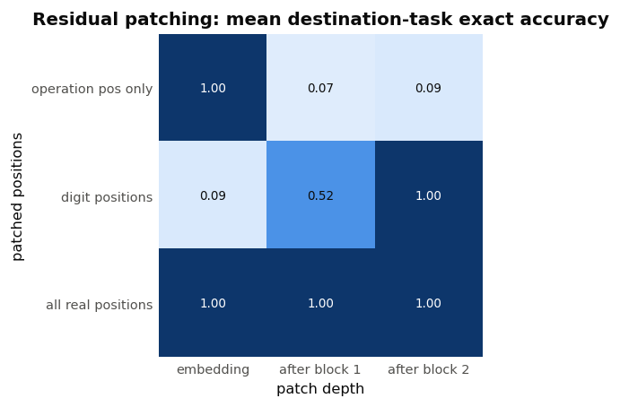
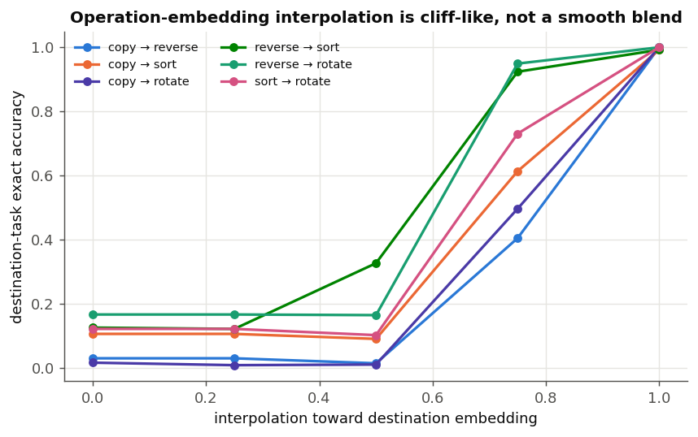
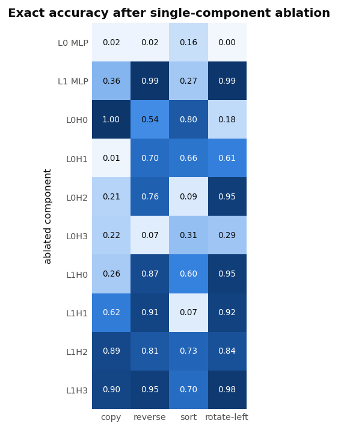

# Causal control in the multi-task transformer

## Summary

The operation token is a genuine, nearly sufficient task switch. Replacing it with another valid operation token reroutes the same digit string to the other task with exactly the destination task's baseline performance: 100% exact for copy, reverse, and rotate-left, and 99.22% for sort. Invalid replacements do not simply select a default task; they reduce original-task exact accuracy to 0.2–30.9%, depending on the token and task.

The more interesting result is *where* that switch acts. At the input embedding (stage 0), patching only the operation position from a destination-task run completely reroutes behavior. After layer 1, operation-position-only patching no longer reroutes (destination exact is only 0.8–16.6%). By then, task control has been broadcast into the digit-position residual stream. Patching digit positions after layer 1 transfers most or all routing behavior for copy/reverse/rotate, while sort is transferred only after layer 2. This is strong causal evidence for an early distributed control signal, followed by a later sort-specific computation.

## Setup

Checkpoint: `checkpoints/multi_task-20260711-103650.pt` (32 residual dimensions, 2 layers, 4 heads, MLP width 64; 18,512 parameters).

All results use one fixed, seeded set of 512 strings, stratified over lengths 2–8. Each string is evaluated under all four operations, so comparisons and patches are paired. Exact accuracy requires every output digit and `=` to be correct; token accuracy is also saved in the raw results. Padding, the operation-prefix position, and padded outputs are excluded from scoring.

| Task | Baseline exact | Baseline token |
|---|---:|---:|
| Copy | 100.00% | 100.00% |
| Reverse | 100.00% | 100.00% |
| Sort | 99.22% | 99.87% |
| Rotate left | 100.00% | 100.00% |

## Token swaps and corruptions

For every one of the 12 directed cross-task token swaps, exact accuracy against the *destination* target equals its clean baseline (100%, except sort at 99.22%). Thus the operation token controls the computation, rather than merely correlating with an output style.

Original-task exact accuracy after an out-of-vocabulary-for-this-position corruption:

| Original task | `<pad>` | `=` | digit `0` |
|---|---:|---:|---:|
| Copy | 2.54% | 1.76% | 1.95% |
| Reverse | 30.86% | 9.57% | 17.58% |
| Sort | 12.30% | 9.77% | 8.79% |
| Rotate left | 14.06% | 10.55% | 12.89% |

The nonzero values should not be read as retained routing in every case. Exact outputs of these elementary operations coincide on some strings—for example, reverse and rotate-left are identical for every length-2 string—and repeated digits create further coincidences. The valid-token swap result avoids this ambiguity by scoring both source and destination targets (all values are in the JSON).

## Residual-stream causal tracing

For a source and destination task applied to the same strings, destination-run activations were patched into the source run. Stage 0 is token-plus-position embeddings; stages 1 and 2 are block outputs. The table reports destination-task exact accuracy, averaged as a range across directed task pairs.

| Patch site | Stage 0 | After layer 1 | After layer 2 |
|---|---:|---:|---:|
| Operation position only | 99.22–100% | 0.78–16.60% | 1.56–16.60% |
| Non-operation real positions | 1.56–16.60% | 6.25–100% | 99.22–100% |
| All real positions | 99.22–100% | 99.22–100% | 99.22–100% |



The per-pair pattern sharpens the interpretation:

- Reverse and rotate-left destination behavior is transferred by patching digit positions after layer 1 (85.74–100%). Copy is not: its two incoming transfers are only 6.25–13.09%. All three reach 100% after layer 2. This asymmetry suggests that reverse/rotate routing is established earlier, while producing the identity map still depends on late source-task state.
- Sort is not transferred by layer-1 digit patches: destination exact is only 6.25–12.11%. It reaches 99.22% after layer 2. Sorting therefore appears to require a distinct second-layer global computation, rather than only selecting a positional routing scheme.
- Patching the operation position after layer 1 does not transfer the task. The token is causally sufficient only before its information has propagated elsewhere.

This experiment patches a whole residual vector, so it localizes control in position and depth, not in a minimal feature subspace. A natural follow-up is distributed alignment search (DAS) or a low-rank causal probe at the digit positions after layer 1.

## Counterfactual interpolation

Linear interpolation between pairs of operation embeddings produces nonlinear, often cliff-like task changes. At the midpoint, no task usually dominates: for copy→reverse, exact accuracies are 23.05% copy and 1.37% reverse; for copy→rotate, both are near 2%. The destination often emerges between 50% and 75% interpolation rather than smoothly blending outputs. Examples at 75% destination embedding:

| Interpolation | Source exact | Destination exact |
|---|---:|---:|
| Copy → reverse | 2.54% | 40.43% |
| Copy → sort | 10.55% | 61.33% |
| Copy → rotate | 1.56% | 49.61% |
| Reverse → sort | 12.50% | 92.38% |
| Reverse → rotate | 16.60% | 94.92% |
| Sort → rotate | 12.11% | 73.05% |



This argues against a simple linear “mixture of algorithms” along raw embedding chords. It is compatible with thresholded routing downstream, curved task regions, or interpolation leaving the learned operation-token manifold.

## Shared versus task-essential components

Single-component ablations reveal shared early machinery and task-selective late MLP use. Exact accuracy after ablation:

| Component | Copy | Reverse | Sort | Rotate left |
|---|---:|---:|---:|---:|
| Layer 0 MLP | 1.76% | 1.76% | 15.82% | 0.20% |
| Layer 1 MLP | 35.94% | 99.22% | 26.76% | 99.22% |
| L0H0 | 100% | 54.49% | 80.08% | 18.16% |
| L0H1 | 1.37% | 70.12% | 65.82% | 60.74% |
| L0H2 | 21.29% | 76.37% | 8.98% | 94.73% |
| L0H3 | 22.27% | 7.03% | 31.45% | 28.52% |
| L1H0 | 25.59% | 87.11% | 59.57% | 95.12% |
| L1H1 | 62.11% | 90.82% | 7.23% | 92.19% |
| L1H2 | 89.26% | 80.66% | 73.44% | 84.18% |
| L1H3 | 90.23% | 94.53% | 70.12% | 97.66% |



Layer 0's MLP and head 3 are broadly essential across tasks. Head specialization is nevertheless clear: L0H0 is dispensable for copy but critical for rotate-left; L0H2 is especially critical for sort but nearly dispensable for rotate-left; L1H1 is especially critical for sort. Most strikingly, the entire layer-1 MLP is dispensable for reverse and rotate-left (both retain 99.22% exact) but important for copy and sort. This agrees with the patching evidence that the two routing tasks can largely finish after shared first-layer control/routing representations, whereas sort needs late nonlinear processing.

These are single ablations and therefore measure necessity in the intact network, not unique sufficiency; redundancy can hide components. Exact sequence accuracy also amplifies small per-token changes, so the accompanying token scores should be consulted when comparing mild effects.

## Reproduction and artifacts

Run from the repository root:

```bash
python research/multitask_causal/analyze.py
```

- Experiment code: `research/multitask_causal/analyze.py`
- Full paired results: `research/multitask_causal/results.json`

The script selects CUDA when available, fixes dataset seed 73031, records checkpoint/config/device metadata, and uses no training data or gradient updates.
