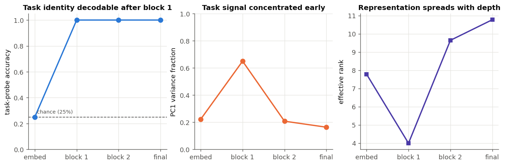
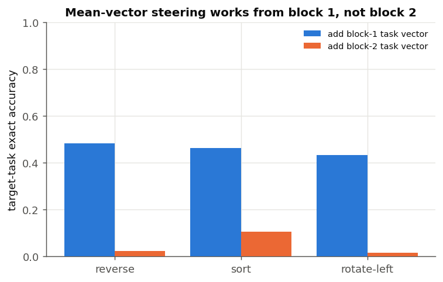
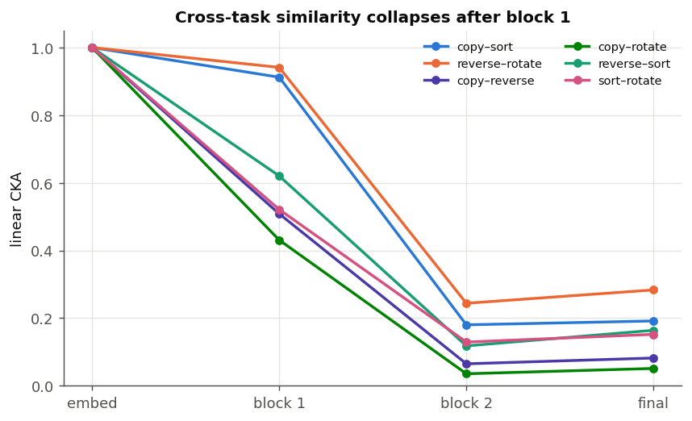

# Multi-task representation geometry

## Scope

This report analyzes the trained checkpoint `checkpoints/multi_task-20260711-103650.pt`
(two layers, width 32, four heads) without further training. The evaluation uses
512 held-out random digit strings at each length 2–8. Crucially, inputs are
paired: copy, reverse, sort, and rotate-left receive exactly the same strings.
This lets task differences be measured without a content-distribution confound.

The checkpoint is essentially perfect on this sample except for sort at the
longest lengths: exact accuracy is 99.8% at length 6, 99.4% at length 7, and
96.3% at length 8. All other task/length cells are 100%. Conclusions about sort
at length 8 therefore describe a slightly imperfect computation.

## Main findings

### The first block broadcasts a compact task signal

A ridge-linear probe trained on digit-position activations predicts the task at
chance (25%) from the embedding-stage representation, then at 100% after block
1. Across all lengths jointly, probe accuracy is 100% after block 1, 99.8% after
block 2, and 99.6% after the final normalization. The train/test split is by
underlying digit string, so paired versions of a held-out string cannot leak
into training.



Task-conditioned differences after block 1 are strikingly additive. Relative
to copy, a single mean difference tensor accounts for 93.0% of reverse, 95.6%
of sort, and 93.8% of rotate-left difference energy (averaged over lengths).
After block 2 those figures fall to 24.2%, 52.2%, and 22.8%; after final
normalization they are 18.8%, 31.7%, and 18.6%. Thus block 1 looks like a task
broadcast/router stage, while block 2 expands the task-conditioned computation
into content-specific states. Sort remains more mean-like than the permutation
tasks, possibly because it needs a shared global aggregation mode.

This is not merely probe evidence. Adding the block-1 mean difference from a
target task to copy activations changes many copy computations into that target:

| Target | Exact target accuracy, length 2 | length 5 | length 8 | mean over lengths |
| --- | ---: | ---: | ---: | ---: |
| Reverse | 80.7% | 55.7% | 4.7% | 48.3% |
| Sort | 95.7% | 41.6% | 8.2% | 46.3% |
| Rotate left | 90.0% | 43.6% | 4.3% | 43.3% |



The same intervention after block 2 is largely ineffective (mean target exact
accuracy 2.3%, 10.5%, and 1.6%). This locates the useful approximately additive
task control before the final content-dependent transformation. However, the
strong length decline means a mean task vector is only a partial program: it
does not capture example-specific routing errors that compound across tokens.

### Shared geometry gives way to task-specific geometry

Linear CKA is 1.0 at digit embeddings, as expected: task tokens differ only at
the prefix, so digit embeddings are identical. After block 1, copy remains very
similar to sort (CKA 0.912 averaged over lengths), while copy–reverse is 0.508
and copy–rotate is 0.431. Reverse–rotate is highest at 0.941. After block 2,
pairwise similarities are much lower: copy–sort is 0.180, reverse–rotate 0.244,
and the other pairs range from 0.036 to 0.129. Final-normalized values remain
low (0.051–0.283).

The elevated reverse–rotate average needs care: at length 2, reverse and
rotate-left are mathematically the same operation and final CKA is 0.939. At
lengths 3–8 their final CKA is only 0.105–0.297. It is therefore evidence of
both true operation overlap at length 2 and some shared permutation machinery,
not evidence that the model uses one identical circuit everywhere.



PCA tells a compatible story. Across tasks, the first principal component
explains 65.0% of example-level variance after block 1 and effective rank is
3.99. After block 2, PC1 explains 20.8% and effective rank rises to 9.64; after
final normalization these are 16.4% and 10.77. The later representation is
therefore more distributed and higher-dimensional, rather than simply four
separated task clusters along one axis.

### Task directions are stable across lengths, but become less universal

Mean task directions (averaged over active positions) are broadly aligned
between lengths. Mean pairwise cosine across lengths after block 1 is 0.972 for
reverse, 0.958 for sort, and 0.954 for rotate-left. After block 2 this drops to
0.850, 0.871, and 0.762. Rotate-left has the strongest length dependence (its
minimum block-2 cross-length cosine is 0.357), consistent with an endpoint
operation whose source mapping changes with the boundary.

The embedding-stage direction is trivially stable because only the operation
token differs; this should not be interpreted as a discovered abstract task
vector. The interesting result is that block 1 broadcasts that prefix
difference into digit states in a coherent, approximately additive form.

## Interpretation

The most economical account is a two-stage multi-task computation:

1. Block 1 reads the operation prefix and broadcasts a low-dimensional control
   state. Copy/sort and reverse/rotate retain especially similar geometry here.
2. Block 2 combines that control state with digits, absolute position, and
   sequence boundary to form task-specific output representations. Geometry
   separates sharply and mean-vector interventions cease to work.

This resembles conditional computation more than four fully isolated subnetworks:
the early representation shares strong structure, and task switching can be
partly induced by activation addition. Yet the late low CKA and poor long-length
steering argue against a single compositional task vector being sufficient.
The model appears to share an early routing mechanism and then execute
task/content-specific transformations, with possible synergy between related
operations (especially the two permutations) but no direct proof of shared
individual heads or neurons from this study alone.

## Limits

- This is one checkpoint and one training seed; geometry need not be stable
  across independently trained models.
- CKA is descriptive and invariant to orthogonal transformations; it does not
  identify a causal circuit.
- Linear probes establish accessible information, not that the model reads the
  probe direction.
- Mean-vector steering changes every active position and can move activations
  off-distribution. Its successes support causal sufficiency in those examples,
  while failures do not prove the absence of a task-vector mechanism.
- Exact-sequence steering naturally becomes harsher with length: a single token
  error fails the entire example.

## Reproduction

Run:

```bash
python research/multitask_geometry/analyze.py
```

The implementation and protocol are in
`research/multitask_geometry/analyze.py`; complete per-length measurements,
including token accuracy, all CKA pairs, PCA spectra summaries, task-vector
energy, and source/target steering accuracy, are in
`research/multitask_geometry/results.json`.
