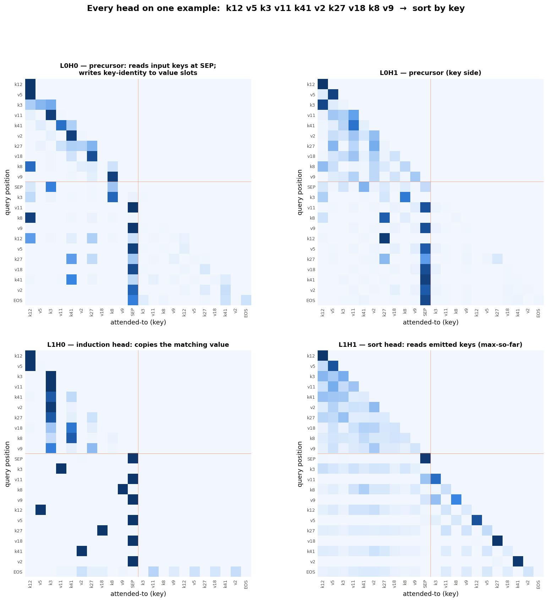
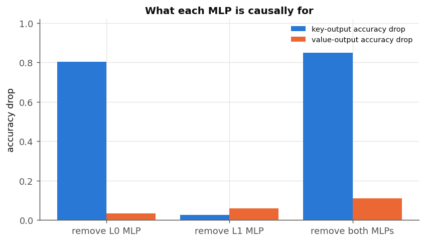
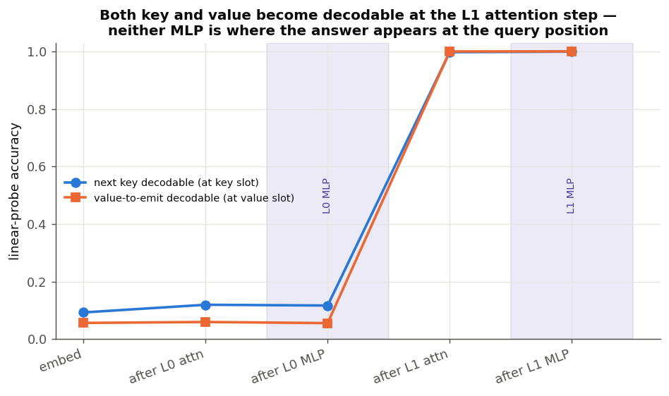
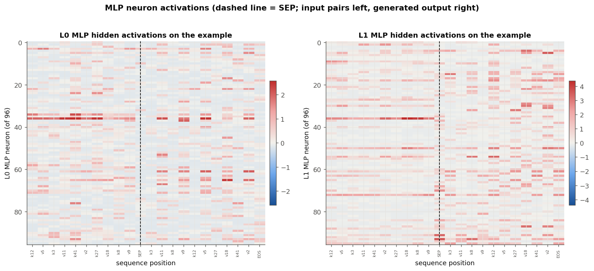
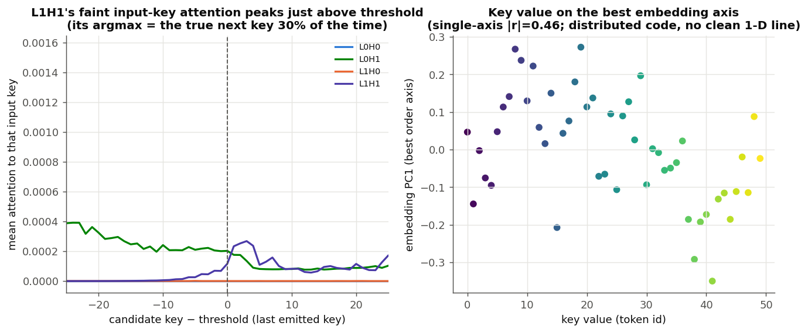

# Sort decoder: a component-by-component walkthrough

This is a guided tour of the 2-layer causal pair-sort decoder (48-wide, 2 heads,
MLP width 96), explaining **all four attention heads and both MLPs** on one concrete
example. It is the example-driven companion to
[`sort-scaling.md`](sort-scaling.md), which has the aggregate statistics and the
multi-seed universality. Everything here is regenerated by
[`research/sort_scaling/walkthrough.py`](../research/sort_scaling/walkthrough.py).

Roles are named for the committed length-30 checkpoint. Head *indices* permute
across seeds (see `sort-scaling.md` §7), so read the names as roles, not addresses.

## The example

The model reads five `(key, value)` pairs, then generates them sorted by key with
each value carried along. Keys are token ids (shown `k·`), values a disjoint set
(shown `v·`), separated by `SEP`:

```
input :  k12 v5  k3 v11  k41 v2  k27 v18  k8 v9   SEP
output:  k3 v11  k8 v9   k12 v5  k27 v18  k41 v2   (EOS)
```

The model emits this exactly. Note the routing: `v5` entered attached to `k12` and
must resurface three slots later next to the sorted `k12`; nothing about the value
tells the model where it belongs — only its key does.

## Reading the heatmaps

Each panel is one head's attention on this example: **row = the position doing the
looking (a query), column = the position being looked at (a key)**. The layout runs
left-to-right / top-to-bottom as `k v k v … SEP k v k v … EOS`; the orange lines
mark `SEP`. Attention is causal, so everything is lower-triangular.



## Layer 0 — the setup

**L0H0 and L0H1 are precursor heads.** In the *input* region (upper-left of each
panel) they run down the diagonal / just-below it — each token attending to itself
or its predecessor. This is the "previous-token" behaviour that lets an induction
head work: it stamps each input value slot with the identity of its own key. In the
*output* region (below the orange line) both heads collapse onto the **`SEP`
column** — the vertical stripe. That is not idleness: at the `SEP` position itself
(the `SEP` row) L0H0 reaches back and reads the input **keys** (0.996 of its mass in
aggregate), depositing the set of present keys into the `SEP` residual.

**The L0 MLP is the key-sorting workhorse.** Ablating it collapses key-output
accuracy from 1.00 to **0.20**, while value accuracy barely moves (0.97):



The L0 MLP consumes what L0 attention gathered at `SEP` and turns the raw
present-key set into the form the next layer can compare against. Its effect is
*upstream* — it prepares information at the `SEP` position, so the sorted key is not
yet readable at the query position right after it (see the probe below).

## Layer 1 — the computation

**L1H1 is the sort head.** In the output region it reads the **already-emitted
keys** with a recency-weighted, staircase pattern (each key-emitting query looks
back at the keys it has produced so far) plus the `SEP` candidate set. Behaviourally
this recovers the running maximum of emitted keys; the next key it selects is the
smallest input key greater than that maximum.

**L1H0 is the induction head — the value carry.** In the output region each
value-emitting query lights up exactly one input cell: the matching input **value**.
Because the input pairs are unsorted, those bright cells are scattered — and that
scatter *is* the sorting permutation applied to route the values. Its output circuit
is a literal copy matrix (see `sort-scaling.md` §7): whatever value it attends to,
it writes to the logits.

**Where is the answer actually computed?** Probing the residual stream for the next
key (at key slots) and the value-to-emit (at value slots), before and after each
MLP:



Both jump from chance to ~1.0 at the **L1 attention** step and are flat across both
MLPs. So the selection and the copy both happen in L1 attention (L1H1 reading the
L0-MLP-prepared candidate set; L1H0 copying the value). The **L1 MLP is minor
cleanup** — removing it costs only 0.03 key / 0.06 value. This refines the coarser
earlier inference (from a post-block probe) that a "block-1 MLP" did the comparison:
at finer resolution the comparison is an *attention* read of an *L0-MLP-prepared*
representation, not an L1-MLP computation.

## The MLPs up close

The hidden activations on the example show the two MLPs are doing different jobs at
different positions (dashed line = `SEP`; input pairs left, generated output right):



The L0 MLP fires broadly across the input pairs and the `SEP` column (it is
processing the gathered key set), whereas the L1 MLP activates more selectively in
the output region around the key-emitting steps. Individual units are not cleanly
monosemantic at this size, but the position structure matches the causal picture:
L0 MLP works on the input/`SEP` setup, L1 MLP on the output-side refinement.

## How the model actually compares keys and picks the next one

The natural guess is a comparator: at each step the model scans the candidate keys,
compares each against the last one, and points at the smallest that is larger. **That
is not what happens.** At a key-emit step, attention to the individual input-key
positions is essentially zero for every head (≤0.003 mass); L1H1 does carry a *faint*
bias toward the smallest key just above the threshold (its input-key attention peaks
at gap 0–3, and its argmax is the true next key ~30% of the time vs ~14% chance), but
that signal is three orders of magnitude too small to be the selector.



Instead the mechanism is a **threshold sweep over a compressed set**:

1. **Menu.** Layer 0 reads the input keys *at the `SEP` position* and compresses the
   whole set of present keys into the `SEP` residual — a static superposition (key
   identity lives in a distributed linear code; the best single embedding axis
   correlates with key value at only r=0.46, so there is no clean 1-D magnitude
   line). At every key step the query pulls this same `SEP` menu (0.9–0.99 mass onto
   `SEP` for three of the four heads).
2. **Moving threshold.** The one head that does *not* read `SEP`, L1H1, reads the
   already-generated keys (0.94 mass) to recover the running maximum of what has been
   emitted. This is the only part that changes from step to step.
3. **Gated readout.** Because the `SEP` contribution is identical at every step, the
   step-to-step difference is carried entirely by the threshold. The next key falls
   out of a **threshold-gated linear readout of (`SEP` menu + threshold)** at the
   L1-attention output — decodable at ~1.0, needing no MLP. As the threshold sweeps
   upward across steps, the readout emits successively larger present keys: the sort.

The causal patch in `sort-scaling.md` §7 confirms the gating directly — overwrite the
last emitted key and the next prediction tracks *the new* running max (99.6%). So the
comparison "`>`" is not an explicit compare-and-select over candidates; it is realised
as a moving-threshold readout of a superposed set. The exact geometry that makes
"menu + threshold → smallest present key above threshold" work is distributed and not
reduced to a single interpretable direction — that is the open frontier of this study.

## Every component, one line each

| component | job | evidence |
|---|---|---|
| **L0H0** | previous-token precursor; at `SEP` reads the input keys | input diagonal + `SEP` column; 0.996 SEP-mass on keys |
| **L0H1** | second precursor (key side) | similar diagonal / `SEP` pattern |
| **L0 MLP** | prepares the candidate key-set gathered at `SEP` | ablation: key 1.00→0.20, value ~unchanged |
| **L1H1** | sort head: reads emitted keys → running max threshold | recency staircase over output keys |
| **L1H0** | induction head: copies the matching input value | one bright value cell per value-emit row (the permutation) |
| **L1 MLP** | minor output-side cleanup | ablation: key −0.03, value −0.06 |

Two channels, computed at the L1-attention step off a layer-0 setup: **L0 gathers
and binds, the L1 attention selects the key (via the L0-MLP-prepared set) and copies
the value (via induction).** The value path never needs an MLP; the key path needs
the L0 MLP to prepare its candidates.

## Caveats

- One checkpoint, one seed (the value/induction head and single precursor recur
  across seeds; the clean single sort head does not — see `sort-scaling.md` §7).
- Attention and probes are descriptive; the ablations are zero-ablations (off
  distribution). Neuron activations are shown for structure, not as a claim that
  individual units are monosemantic.

## Reproduce

```bash
python research/sort_scaling/walkthrough.py
```
