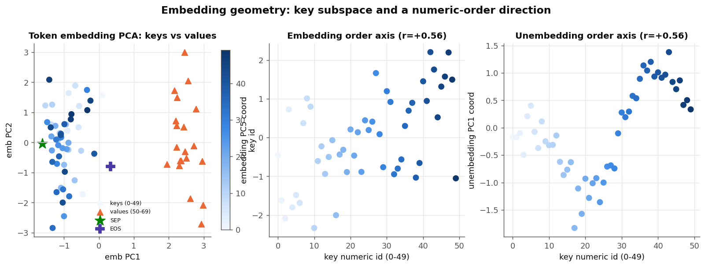
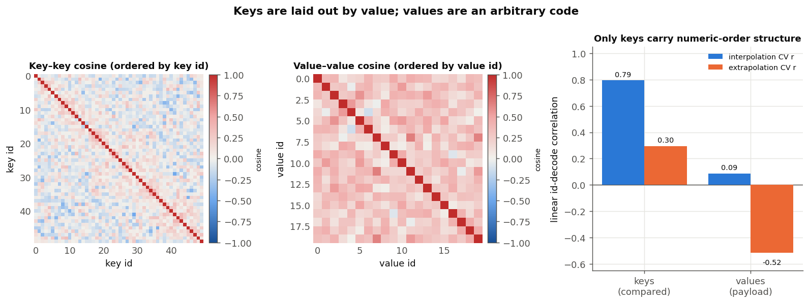
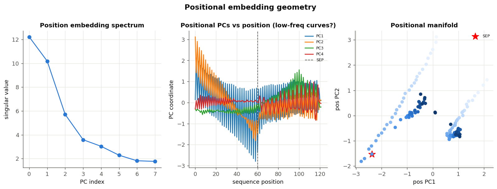

# Embedding geometry

The decoder has two learned embedding tables: the **token embedding** (73 × 48 — the
50 keys, 20 values, and `SEP`/`EOS`/`PAD`) and the **positional embedding**
(122 × 48). This report looks at how each is laid out in the 48-dim space. Figures
from [`research/sort_scaling/embeddings.py`](../research/sort_scaling/embeddings.py)
and [`research/sort_scaling/agent_geometry.py`](../research/sort_scaling/agent_geometry.py),
on the main length-30 checkpoint.

## Token embeddings: keys and values are separate families



Keys (ids 0–49) and values (ids 50–69) occupy **cleanly separable subspaces** (a
linear classifier splits them at ~100% CV) — visible as two clusters in the token-PCA
(left). Each numeric key value has *some* alignment with a single embedding axis
(best axis r ≈ 0.46; the unembedding is a bit cleaner at 0.56), but no single axis is
a clean magnitude line.

## Only keys carry numeric order — values are an arbitrary code

This is the sharp, interpretable asymmetry. The decoder **compares** keys (the sort
readout is a "is `k > θ`?" logit cliff) but only **copies** values (by identity, never
compared). So keys should be laid out by numeric value and values should not need to
be — and that is exactly what the embeddings show:



Linearly decoding the numeric id from the raw embedding vectors:

| alphabet | interpolation CV r | extrapolation CV r |
|---|---:|---:|
| **keys** (compared) | **0.79** | 0.30 |
| **values** (payload) | 0.09 | −0.52 (noise) |

- **Keys carry a real order code.** With held-out ids interspersed among trained ones
  (interpolation), a linear map recovers the key value at **r ≈ 0.79** (robust — ridge
  regularisation raises it to ~0.85). It is a *distributed* code, not a clean global
  line: predicting a held-out id *range* (extrapolation) drops to **r = 0.30** (the
  figure in the geometry study), so the order does not extend cleanly to unseen
  ranges. Both facts fit the comparison mechanism — the readout needs to order the
  keys it has seen, not extrapolate.
- **Values carry essentially no order** (interpolation r = 0.09; extrapolation is just
  noise). Their cosine matrix (middle panel) is a fairly uniform positive blob — a
  compact, roughly isotropic cone of arbitrary codes — while the key cosine matrix
  (left) has more structure. Values only ever need to be distinct enough to be copied
  by their key, so the model never bothered to order them.

## Positional embeddings: an alternating slot code with a boundary at `SEP`



The positional table is dominated by a few directions (left) but its structure is
**not a smooth low-frequency curve**. The top PC (middle) is a high-amplitude
**zig-zag** — adjacent positions have mean cosine ≈ −0.27 — encoding the strict
**key-slot / value-slot alternation** of the interleaved `k v k v …` layout (parity
is linearly decodable at 0.99). There is a clear **regime change at `SEP`**: the
input region and the generated-output region use different positional structure
(region decodable at 0.84), and the absolute output rank-slot is linearly encoded
(r = 1.0). So position tells the model three things — am I on a key slot or a value
slot, am I in the input or the output, and which rank slot — which is exactly the
scaffolding the two-channel algorithm runs on.

## Why this matters for the algorithm

The embedding geometry pre-wires the division of labour: **keys** arrive already
arranged by value (so the L1 readout can threshold them), **values** arrive as an
unordered code (so they can only be routed by identity, forcing the induction copy),
and **position** supplies the key/value/rank scaffolding. See
[`sort-algorithm.md`](sort-algorithm.md) for how the layers consume this.

## Caveats

One checkpoint; 50 keys / 20 values in 48 dims make linear id-decodes permissive, so
the interpolation numbers are upper-ish bounds — but the key-vs-value *contrast* holds
under every regularisation and CV scheme tried.

## Reproduce

```bash
python research/sort_scaling/embeddings.py       # key vs value order
python research/sort_scaling/agent_geometry.py   # token-PCA + positional figures
```
