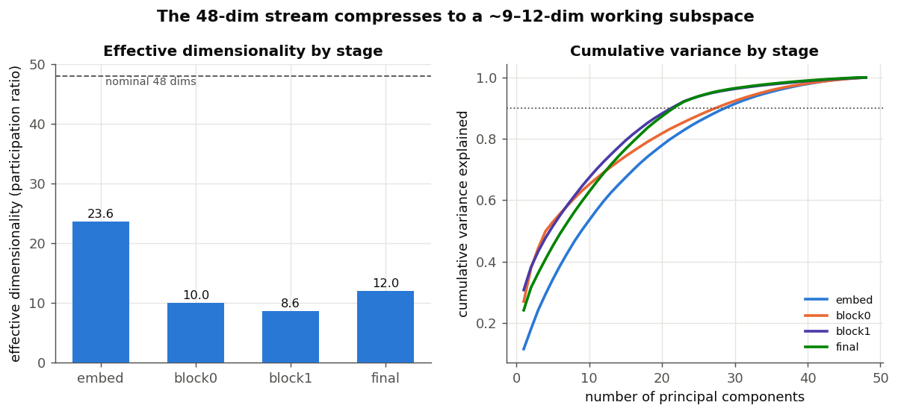
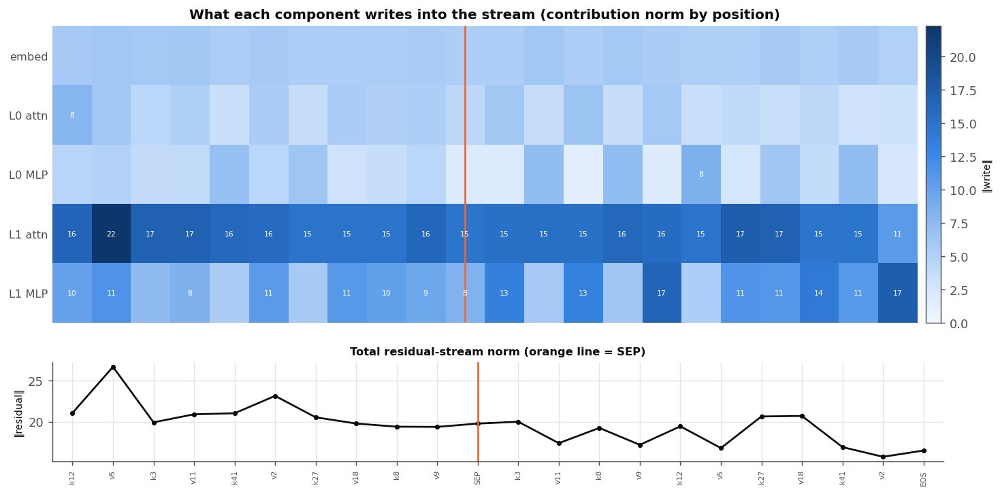
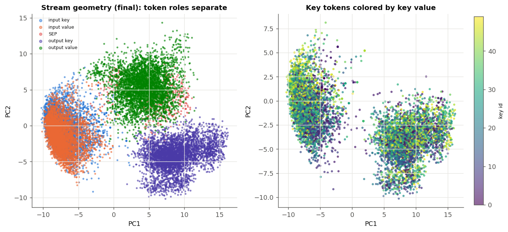
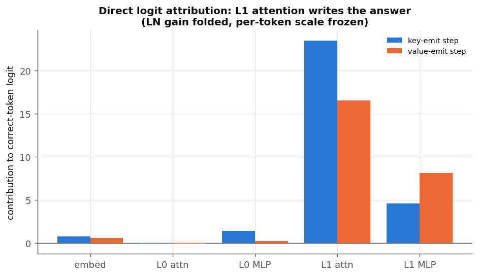

# The activation (residual) stream

The decoder's activation stream is **48-dimensional** (`d_model = 48`): every token
position carries one 48-vector, and every component reads from and writes back into
that shared stream. This report looks at the stream itself — how many of those 48
dims are actually used, what each component writes into it, its geometry, and which
component writes the output. Generated by
[`research/sort_scaling/residual_stream.py`](../research/sort_scaling/residual_stream.py)
on the main length-30 checkpoint.

## How many dimensions does it really use?

Nominally 48, but the *effective* dimensionality (participation ratio,
`(Σλ)² / Σλ²`) is far lower and changes with depth:

| stage | effective dims | PCs for 90% variance |
|---|---:|---:|
| embedding | 23.6 | 29 |
| after block 0 | 10.0 | 28 |
| after block 1 | 8.6 | 22 |
| final | 12.0 | 22 |



The **embedding is the highest-dimensional stage** (~24 effective dims) — the
position embedding alone spreads variance across many directions. The network then
**distills that into a ~9-dimensional working representation** by block 1, and the
final stage sits at ~12. So the actual sort computation lives in roughly **9–12 of
the 48 dimensions**; the rest of the stream is close to unused. (Participation ratio
weights by variance², so it reads lower than the ~22–29 PCs needed for 90% variance —
both say the same thing: a handful of dominant directions plus a light tail.)

## What each component writes into the stream

Decomposing the residual at each position into the sum of its component writes
(embedding + each layer's attention and MLP), and taking the norm of each:



**L1 attention is by far the largest writer at every position** (norm ~15–22),
followed by the L1 MLP; the embedding and both L0 components write comparatively
little into the residual norm. The total stream norm is fairly flat (~17–27) across
positions with no runaway growth — this tiny model does not rely on norm blow-up.

## The geometry of the stream

Projecting the final-stage states to their top two principal components and colouring
by token role:



- **Token roles occupy distinct regions:** input keys/values on the left, **output
  values** top, **output keys** bottom-right, `SEP` near the output block. The stream
  keeps "what am I and where" cleanly separated — the same split that lets the
  induction head route by role.
- **Keys are not laid out by value.** Colouring the key tokens by their key id (right
  panel) shows no gradient along PC1/PC2 — the key-order information is a distributed
  code, not a visible magnitude axis, matching the comparison-mechanism finding
  ([`sort-circuit-walkthrough.md`](sort-circuit-walkthrough.md)).

An interactive 3D version (`python research/sort_scaling/build_stream3d.py` → a
standalone `research/sort_scaling/stream_3d.html`, also published as an Artifact)
plots the states in one shared PCA-3D frame with a stage toggle, so you can watch the
role clusters sharpen from embedding to final: cluster separation (1 − within/total
variance) rises from **0.58 at the embedding** to **0.75–0.83** once past block 0.

## Which component writes the answer?

Direct logit attribution — projecting each component's residual write onto the
correct next-token's unembedding direction (LayerNorm gain folded, per-token scale
frozen) — at the key-emit and value-emit positions:



**L1 attention writes the answer** at both steps (contribution 23.5 to the correct
key logit, 16.5 to the correct value logit), with the L1 MLP a distant second (4.6 /
8.1) and the embedding and L0 components near zero. This is the direct-effect version
of the earlier finding that both the sort selection and the value copy are realised
in L1 attention, with the MLPs as cleanup. Note the L1 MLP's larger share at the
value step (8.1 vs 4.6) is consistent with it doing a little more work there.

## Caveats

One checkpoint. Participation ratio and PCA are descriptive; direct logit attribution
uses the standard frozen-LayerNorm linearisation (it drops the per-token `1/std` and
mean-centring constant, so absolute logit magnitudes are approximate while the
*relative* component ordering is robust).

## Reproduce

```bash
python research/sort_scaling/residual_stream.py
```
