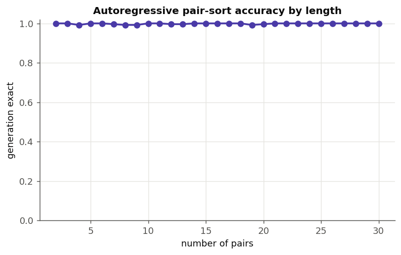
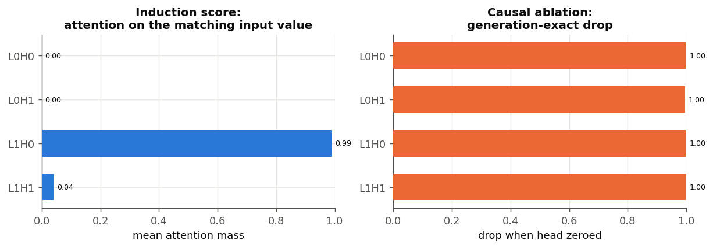
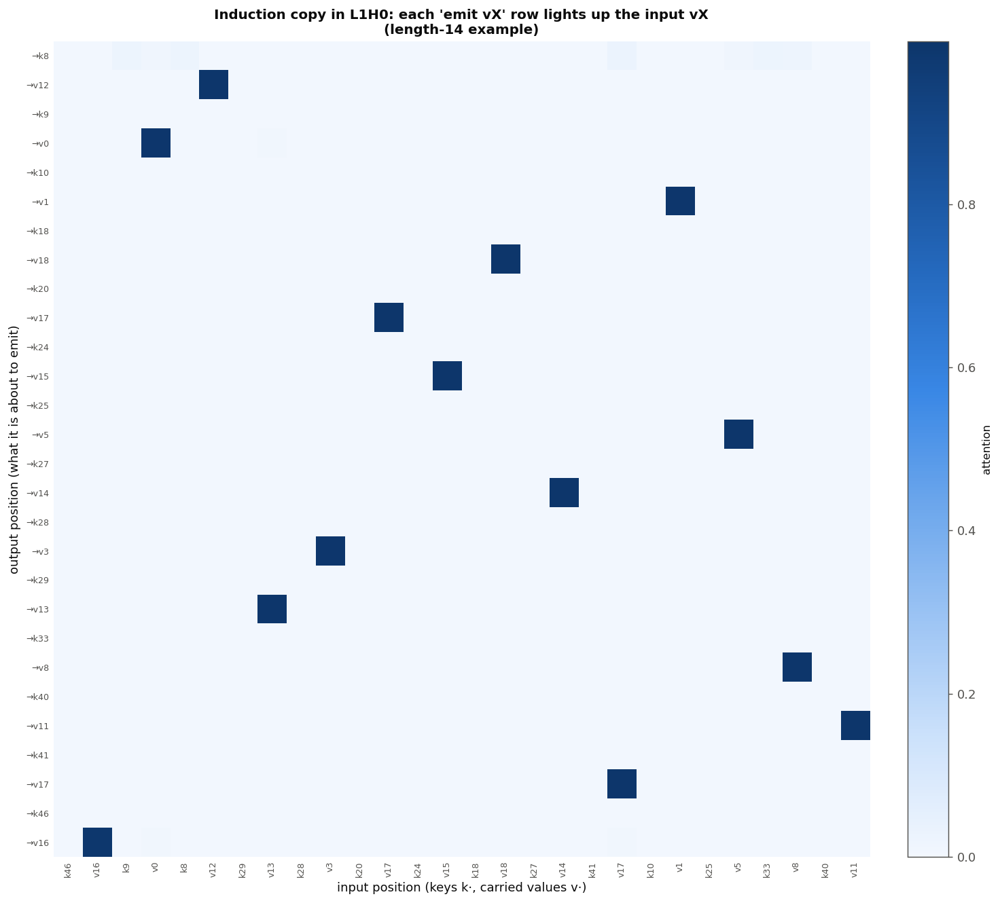
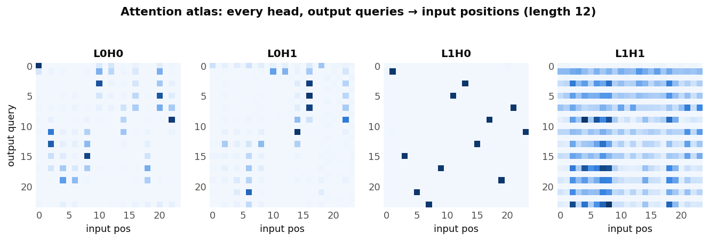
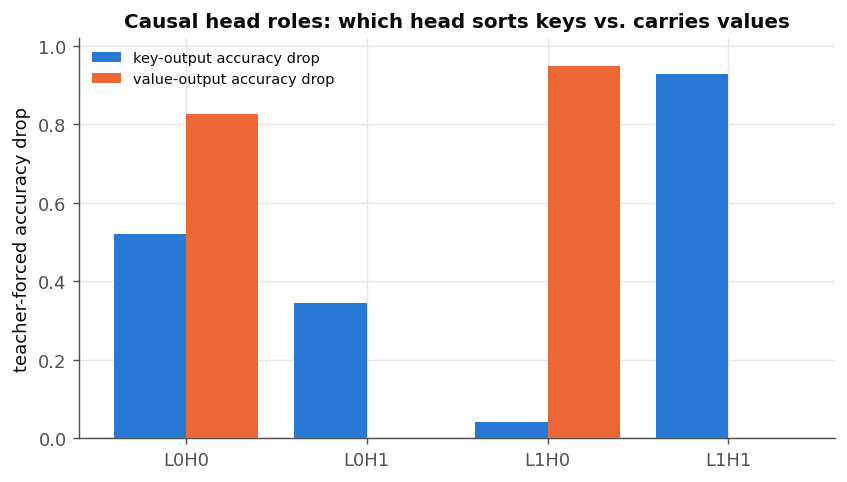
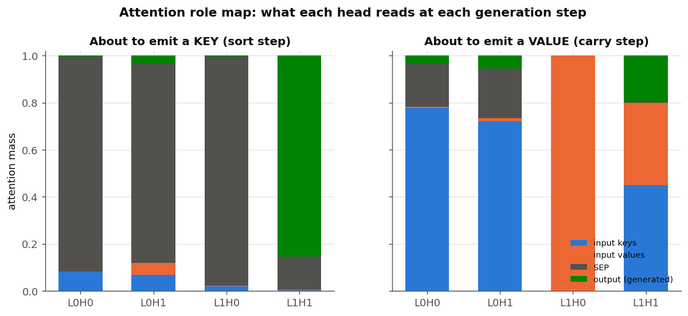
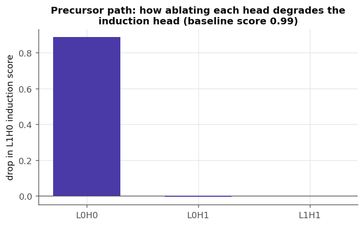
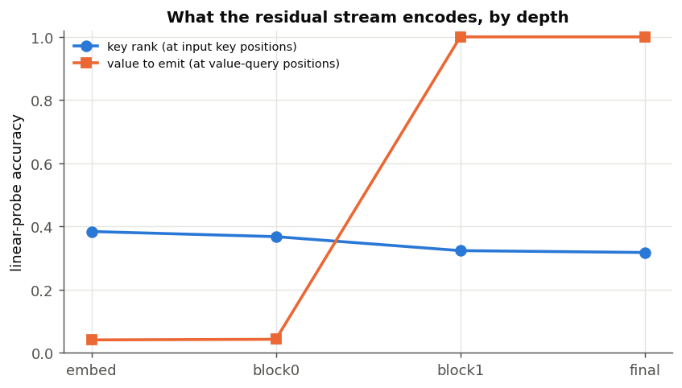
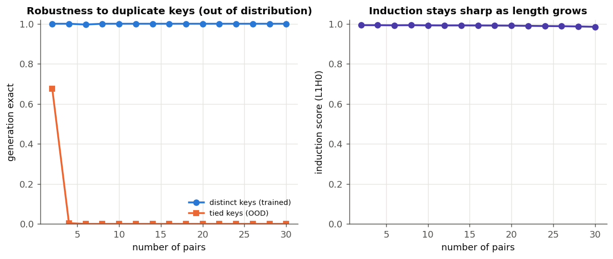

# Scaling sort, and what forces a routing circuit

## Question

Can a tiny transformer be scaled to sort long strings, and if so, does it discover
a recognisable *sorting network* inside? The existing length-8 sort study left the
attention map diffuse, so this study scales the alphabet to 20 symbols and the
length to 30 and looks harder.

All code is self-contained in `research/sort_scaling/`; nothing in `app/` changes.

## 1. Plain sort is counting, not a sorting network

Training the in-place encoder to sort a 30-long string over a bounded 20-symbol
alphabet succeeds, but the depth ladder gives the mechanism away. Holding width
and heads fixed at 32/2 and sweeping layers (6,000 steps each):

| layers | exact accuracy (length ≤30) |
|---|---:|
| 1 | 0.733 |
| **2** | **0.928** |
| 3 | 0.755 |
| 4 | 0.793 |

Accuracy peaks at two layers and *falls* with more depth. A comparison-based
sorting network would reward depth; a **counting sort** (build a histogram of the
bounded alphabet, then emit values in order) factors naturally into ~2 stages and
is what the optimiser finds. With a bounded alphabet the model never has to move a
token — it just counts — so the attention pattern stays diffuse and uninformative.

## 2. Removing the counting shortcut: sort key–value pairs

To force genuine routing, sort **(key, value) pairs by key with the value carried
along**. A histogram of keys cannot reconstruct which value rode with which key, so
the model must actually gather each value from its source pair. Keys are sampled
without replacement (distinct) so each value routes by a unique key identity.

## 3. The encoder cannot learn to carry values

This task **would not train** in the bidirectional in-place encoder, at any setting
tried: depth 1–4, width 32–64, length 5–30, tied or distinct keys, learning rate
0.0015–0.003, up to 40,000 steps. Token accuracy pins near 0.6 — the value of
"sort the keys perfectly, leave the values at chance."

The reason is mechanistic: counting sort emits sorted keys *without ever computing
an argsort permutation*, so the key computation hands the value channel no pointer
to route with. The encoder would have to bootstrap a data-dependent gather from
scratch, and gradient descent never leaves the counting basin.

## 4. The fix: autoregressive generation with a causal decoder

Reframe sort as generation. A causal decoder reads the pairs and then *emits* the
sorted pairs left to right:

```
k0 v0 k1 v1 … k_{n-1} v_{n-1}  SEP  sk_0 sv_0 … sk_{n-1} sv_{n-1}  EOS
```

Now carrying the value after its sorted key is an **induction copy** — "find sk_q
back in the input and emit the token that follows it" — the circuit causal
transformers learn most readily. This trains easily. Every architecture searched
solved length-30 pair-sort (≥99.6% autoregressive-generation exact); the minimal
one is a **2-layer, 2-head, 48-wide decoder (≈51k parameters)**, which reaches
**99.9% generation-exact** and is at 99–100% at every length from 2 to 30.

| decoder (d/heads/layers/ff) | params | gen-exact @ length 30 |
|---|---:|---:|
| **48 / 2 / 2 / 96** | **50,953** | **0.998** |
| 48 / 4 / 3 / 96 | 69,913 | 0.996 |
| 64 / 4 / 2 / 128 | 84,297 | 0.997 |
| 64 / 4 / 3 / 128 | 117,769 | 0.999 |
| 64 / 4 / 4 / 128 | 151,241 | 1.000 |



## 5. Inside the circuit: an induction head carries the values

In the minimal two-layer decoder the value-carry localises to a single head in the
final layer. Measuring, for each head, the attention that a value-emitting position
places on the input value token of the matching pair:

| head | induction score | attention on matching *key* | ablation drop (gen-exact) |
|---|---:|---:|---:|
| **L1H0** | **0.99** | 0.00 | 1.00 |
| L1H1 | 0.04 | 0.04 | 1.00 |
| L0H0 | 0.00 | 0.06 | 1.00 |
| L0H1 | 0.00 | 0.06 | 1.00 |

L1H0 places 99% of its attention on the matching input *value* and essentially none
on the key — the signature of an induction copy (attend to the token *after* the
matched key). All four heads are individually necessary (a minimal model has no
redundancy, so every ablation breaks exact accuracy), so it is the induction
*score*, not ablation, that singles out the value-carrier; the layer-0 heads and
L1H1 do the key-sorting and precursor matching.



The attention map makes the mechanism visible. Each output row that is about to
emit a value `vX` places almost all of its attention on the input token `vX` — it
copies the value directly from its source pair. Because the input pairs are in
unsorted order, the bright cells are scattered rather than diagonal: that scatter
*is* the sort permutation, realised as data-dependent routing.



## 6. The full circuit (deep dive)

A battery of analyses (`research/sort_scaling/deep_interp.py`) pins down how all
four heads cooperate. Two facts organise everything: the model **sorts by
generation** and **carries values by induction**.



The atlas above previews the roles: only **L1H0** is a sharp one-cell-per-query
router (the induction copy); the other three are broader.

### Two specialised layer-1 heads

Ablating each head and scoring the key-output and value-output positions
*separately* shows a clean split of labour in the final layer:



- **L1H0** is the value head (value-output drop 0.95, key-output drop 0.04).
- **L1H1** is the key/sort head (key-output drop 0.93, value-output drop 0.00).
- **L0H0/L0H1** are precursors that matter for both.

### Each head reads a different thing at each step

Splitting attention by generation step and destination makes the roles concrete:



- When **emitting a value**, the two layer-0 heads read the **input keys** (≈0.75
  mass) — the precursor lookup — while **L1H0 puts ~100% on the input values**
  (the induction copy).
- When **emitting a key**, **L1H1 reads the already-generated output** (≈0.85
  mass): it decides the next key by looking at the sorted keys emitted so far.
  This is sorting *by generation*, not by a precomputed order. The idle heads park
  on the `SEP` token, which acts as an attention sink.

### The induction head has a single precursor

The value copy is a two-head induction circuit. Zeroing each other head and
re-measuring L1H0's induction score isolates its dependency:



Removing **L0H0** drops L1H0's induction score from 0.99 to ~0.10; L0H1 and L1H1
do nothing to it. L0H0 is the previous-token-style precursor that writes the
key→value association L1H0 reads. The copy is content-based, not positional: L1H0's
attention has the highest across-example variation of any head, and its argmax
lands on the exactly-matching input value **100%** of the time.

### What the residual stream represents

Linear probes across depth confirm the two-stage picture:



The value to emit is essentially undecodable until **block 1**, where it jumps to
100% — exactly where L1H0 writes it. Meanwhile the **global rank** of a key is
never linearly decodable (~0.35 at every stage), reinforcing that the model never
computes an explicit ordering; it generates the next key locally instead.

### Where it breaks

The induction match is by key *identity*, so the model is sharp at every trained
length but brittle off-distribution:



On the distinct-key distribution it generates perfectly from 2 to 30 pairs, and the
induction score stays ≈0.99 across that whole range. Introduce **duplicate keys**
(never seen in training) and it collapses beyond a couple of pairs: with ties there
is no unique key to match, so the identity-based induction has nothing to point at.

### Circuit summary

```
L0H0  precursor: reads input keys, writes key→value binding  ─┐
L0H1  key precursor                                            │
                                                               ▼
L1H0  induction head: matches key identity, copies the value (values)
L1H1  sort head: reads generated output, emits the next key   (keys)
```

## Verdict

Scaled sort does **not** discover a comparison sorting network. Over a bounded
alphabet it discovers counting sort. When the task is changed to force routing, a
*causal* model solves it with a two-part circuit — sort-by-generation for the keys
and an **induction head** that associatively copies each value from its source
pair — while the bidirectional encoder cannot learn it at all. The architectural
prior (causal vs. bidirectional) decides which algorithm is reachable.

## Reproduce

```bash
# 1. counting-sort depth ladder (encoder)
python research/sort_scaling/train.py --task values --search --steps 6000
# 2. encoder fails on pair-sort (any config)
python research/sort_scaling/train.py --task pairs --config 48 2 2 96 --max-len 30 --steps 10000
# 3. causal decoder solves pair-sort
python research/sort_scaling/causal_sort.py --config 48 2 2 96 --max-len 30 --steps 13000 --save
# 4. interpretability: value-carrying induction head
python research/sort_scaling/causal_analyze.py --length 14
# 5. full-circuit deep dive (head roles, sort mechanism, probes, robustness)
python research/sort_scaling/deep_interp.py --length 12
```

Raw search results and metrics are the `search*.json` / `*_analysis.json` files in
`research/sort_scaling/`.
