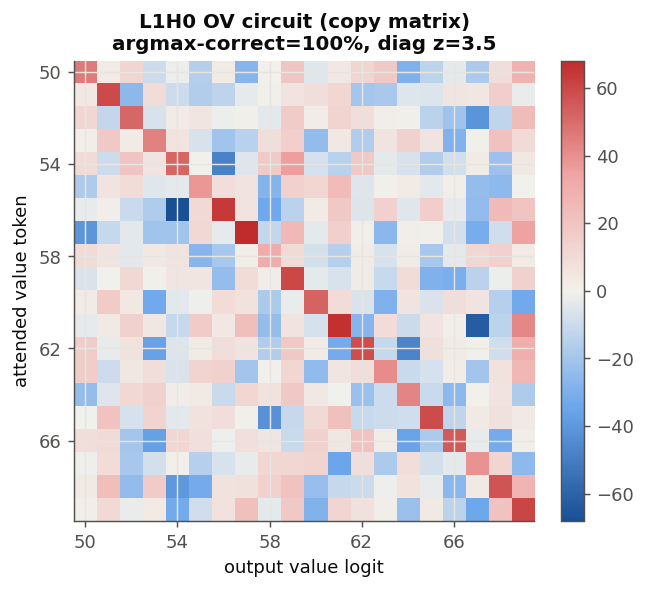
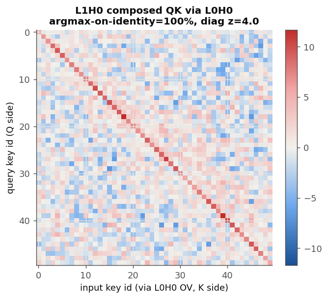
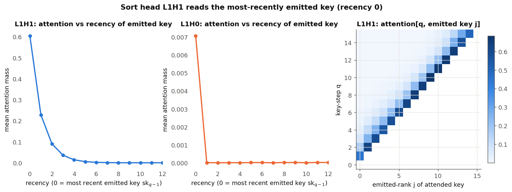
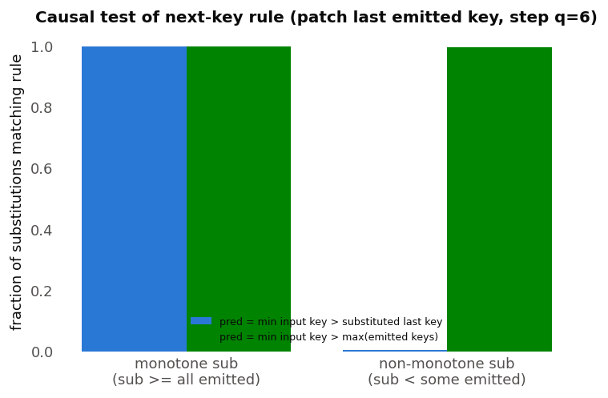
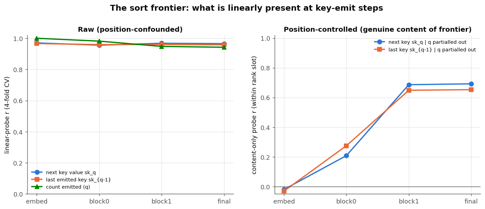
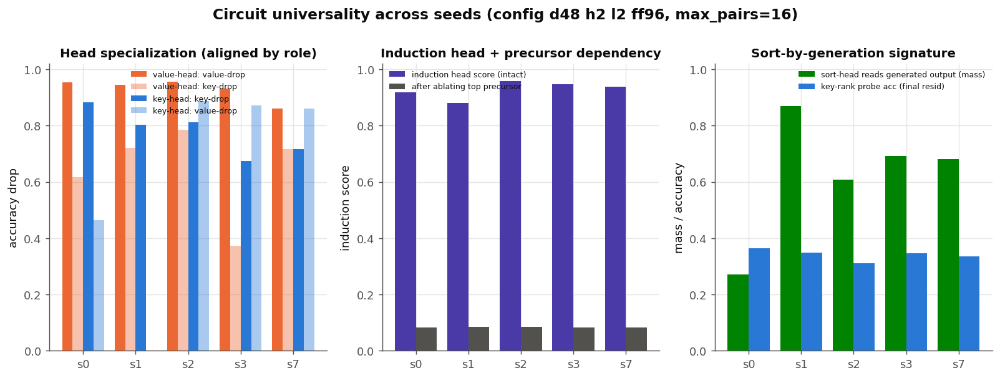
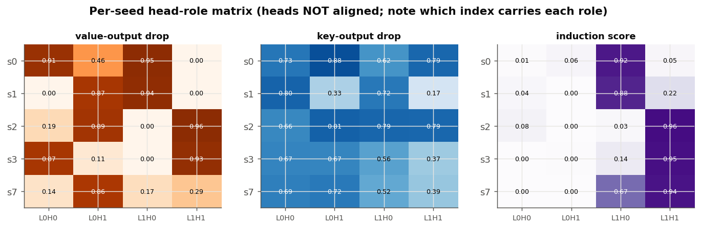
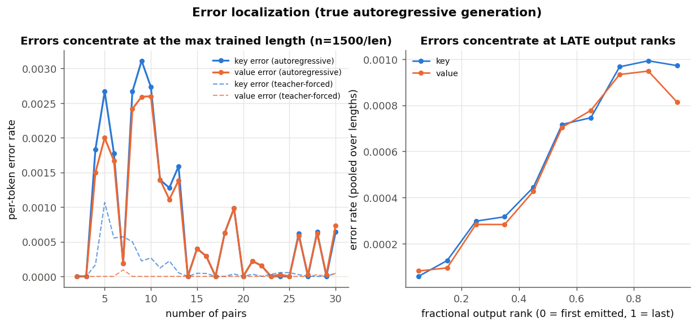
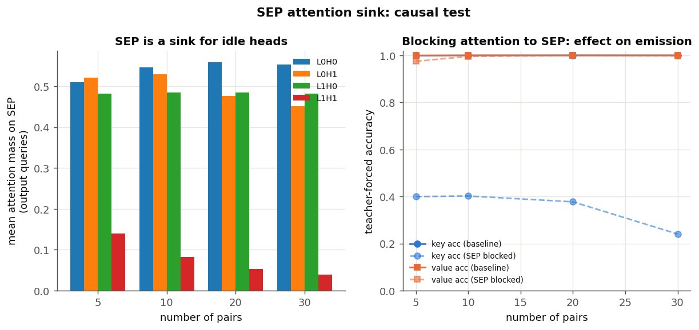
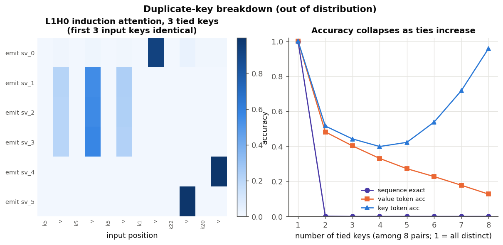

# Scaling sort, and what forces a routing circuit

## Question

Can a tiny transformer be scaled to sort long strings, and if so, does it discover
a recognisable *sorting network* inside? The existing length-8 sort study left the
attention map diffuse, so this study scales the alphabet to 20 symbols and the
length to 30 and looks harder.

All code is self-contained in `research/sort_scaling/`; nothing in `app/` changes.

## 1. Plain sort is counting, not a sorting network

Training the in-place encoder to sort a 30-long string over a bounded 20-symbol
alphabet succeeds, but the depth ladder gives the mechanism away. Holding width
and heads fixed at 32/2 and sweeping layers (6,000 steps each):

| layers | exact accuracy (length ≤30) |
|---|---:|
| 1 | 0.733 |
| **2** | **0.928** |
| 3 | 0.755 |
| 4 | 0.793 |

Accuracy peaks at two layers and *falls* with more depth. A comparison-based
sorting network would reward depth; a **counting sort** (build a histogram of the
bounded alphabet, then emit values in order) factors naturally into ~2 stages and
is what the optimiser finds. With a bounded alphabet the model never has to move a
token — it just counts — so the attention pattern stays diffuse and uninformative.

## 2. Removing the counting shortcut: sort key–value pairs

To force genuine routing, sort **(key, value) pairs by key with the value carried
along**. A histogram of keys cannot reconstruct which value rode with which key, so
the model must actually gather each value from its source pair. Keys are sampled
without replacement (distinct) so each value routes by a unique key identity.

## 3. The encoder cannot learn to carry values

This task **would not train** in the bidirectional in-place encoder, at any setting
tried: depth 1–4, width 32–64, length 5–30, tied or distinct keys, learning rate
0.0015–0.003, up to 40,000 steps. Token accuracy pins near 0.6 — the value of
"sort the keys perfectly, leave the values at chance."

The reason is mechanistic: counting sort emits sorted keys *without ever computing
an argsort permutation*, so the key computation hands the value channel no pointer
to route with. The encoder would have to bootstrap a data-dependent gather from
scratch, and gradient descent never leaves the counting basin.

## 4. The fix: autoregressive generation with a causal decoder

Reframe sort as generation. A causal decoder reads the pairs and then *emits* the
sorted pairs left to right:

```
k0 v0 k1 v1 … k_{n-1} v_{n-1}  SEP  sk_0 sv_0 … sk_{n-1} sv_{n-1}  EOS
```

Now carrying the value after its sorted key is an **induction copy** — "find sk_q
back in the input and emit the token that follows it" — the circuit causal
transformers learn most readily. This trains easily. Every architecture searched
solved length-30 pair-sort (≥99.6% autoregressive-generation exact); the minimal
one is a **2-layer, 2-head, 48-wide decoder (≈51k parameters)**, which reaches
**99.9% generation-exact** and is at 99–100% at every length from 2 to 30.

| decoder (d/heads/layers/ff) | params | gen-exact @ length 30 |
|---|---:|---:|
| **48 / 2 / 2 / 96** | **50,953** | **0.998** |
| 48 / 4 / 3 / 96 | 69,913 | 0.996 |
| 64 / 4 / 2 / 128 | 84,297 | 0.997 |
| 64 / 4 / 3 / 128 | 117,769 | 0.999 |
| 64 / 4 / 4 / 128 | 151,241 | 1.000 |


## 5. Inside the circuit: an induction head carries the values

In the minimal two-layer decoder the value-carry localises to a single head in the
final layer. Measuring, for each head, the attention that a value-emitting position
places on the input value token of the matching pair:

| head | induction score | attention on matching *key* | ablation drop (gen-exact) |
|---|---:|---:|---:|
| **L1H0** | **0.99** | 0.00 | 1.00 |
| L1H1 | 0.04 | 0.04 | 1.00 |
| L0H0 | 0.00 | 0.06 | 1.00 |
| L0H1 | 0.00 | 0.06 | 1.00 |

L1H0 places 99% of its attention on the matching input *value* and essentially none
on the key — the signature of an induction copy (attend to the token *after* the
matched key). All four heads are individually necessary (a minimal model has no
redundancy, so every ablation breaks exact accuracy), so it is the induction
*score*, not ablation, that singles out the value-carrier; the layer-0 heads and
L1H1 do the key-sorting and precursor matching.


The attention map makes the mechanism visible. Each output row that is about to
emit a value `vX` places almost all of its attention on the input token `vX` — it
copies the value directly from its source pair. Because the input pairs are in
unsorted order, the bright cells are scattered rather than diagonal: that scatter
*is* the sort permutation, realised as data-dependent routing.


## 6. The full circuit (deep dive)

A battery of analyses (`research/sort_scaling/deep_interp.py`) pins down how all
four heads cooperate. Two facts organise everything: the model **sorts by
generation** and **carries values by induction**.


The atlas above previews the roles: only **L1H0** is a sharp one-cell-per-query
router (the induction copy); the other three are broader.

### Two specialised layer-1 heads

Ablating each head and scoring the key-output and value-output positions
*separately* shows a clean split of labour in the final layer:


- **L1H0** is the value head (value-output drop 0.95, key-output drop 0.04).
- **L1H1** is the key/sort head (key-output drop 0.93, value-output drop 0.00).
- **L0H0/L0H1** are precursors that matter for both.

### Each head reads a different thing at each step

Splitting attention by generation step and destination makes the roles concrete:


- When **emitting a value**, the two layer-0 heads read the **input keys** (≈0.75
  mass) — the precursor lookup — while **L1H0 puts ~100% on the input values**
  (the induction copy).
- When **emitting a key**, **L1H1 reads the already-generated output** (≈0.85
  mass): it decides the next key by looking at the sorted keys emitted so far.
  This is sorting *by generation*, not by a precomputed order. The idle heads park
  on the `SEP` token, which acts as an attention sink.

### The induction head has a single precursor

The value copy is a two-head induction circuit. Zeroing each other head and
re-measuring L1H0's induction score isolates its dependency:


Removing **L0H0** drops L1H0's induction score from 0.99 to ~0.10; L0H1 and L1H1
do nothing to it. L0H0 is the previous-token-style precursor that writes the
key→value association L1H0 reads. The copy is content-based, not positional: L1H0's
attention has the highest across-example variation of any head, and its argmax
lands on the exactly-matching input value **100%** of the time.

### What the residual stream represents

Linear probes across depth confirm the two-stage picture:


The value to emit is essentially undecodable until **block 1**, where it jumps to
100% — exactly where L1H0 writes it. Meanwhile the **global rank** of a key is
never linearly decodable (~0.35 at every stage), reinforcing that the model never
computes an explicit ordering; it generates the next key locally instead.

### Where it breaks

The induction match is by key *identity*, so the model is sharp at every trained
length but brittle off-distribution:


On the distinct-key distribution it generates perfectly from 2 to 30 pairs, and the
induction score stays ≈0.99 across that whole range. Introduce **duplicate keys**
(never seen in training) and it collapses beyond a couple of pairs: with ties there
is no unique key to match, so the identity-based induction has nothing to point at.

### Circuit summary

```
L0H0  precursor: reads input keys, writes key→value binding  ─┐
L0H1  key precursor                                            │
                                                               ▼
L1H0  induction head: matches key identity, copies the value (values)
L1H1  sort head: reads generated output, emits the next key   (keys)
```

## 7. Deeper mechanisms

A second round of focused analyses (each in `research/sort_scaling/agent_*.py`,
findings under `research/sort_scaling/agent_findings/`) reverse-engineers the two
channels down to the weights and to causal rules.

### The value copy, at the weight level

Reading the induction head's OV circuit directly from the weights — the effective
map `W_U · Wo · Wv · W_E` over the value tokens (LayerNorm gain folded, data-dependent
scale dropped) — shows it is a **clean copy matrix**: attending to value token X
raises the logit of X and nothing else (argmax-correct 20/20, chance 1/20; diagonal
z = 3.5). Restricted to key tokens it is *not* a copy (2%, chance), so the copy is
specific to the value subspace it transports. (Independently reproduced.)



The match is the subtle part. L1H0's QK over **raw** key embeddings does *not* match
on identity (0% argmax) — so it is not a naive induction head. But the key identity
does not arrive at an input value position as a raw embedding: the L0H0 precursor
writes it there. Feeding L0H0's OV output through L1H0's key map, `Wk1·g·Wo0·Wv0·E`,
turns the QK into a **perfect identity matcher** (50/50, chance 1/50; z = 4.0), and
the L0H0→L1H0 K-composition is +12.7σ above random while the sibling head L0H1 sits
at baseline. This is the weight-level counterpart of the ablation result (removing
L0H0 collapses the induction score 0.99→0.10): the induction match runs *through*
L0H0.



### The sort rule, causally

The sort head **L1H1** chooses the next key by reading the already-emitted keys with
sharp **recency weighting** (0.61 mass on the most recent, geometric tail over the
last few) — a soft "max-so-far."



A causal patch pins the exact rule. Overwrite the last-emitted key at a key step and
read the prediction: for order-preserving substitutions the model emits *the smallest
input key greater than the substituted key* (99.8%). But for **non-monotone** (OOD)
substitutions — where the patched key is smaller than an earlier emitted key — the
"greater than the last key" rule matches only 0.4%, while *"smallest input key
greater than the running **max** of all emitted keys"* matches 99.6%. So the
operative threshold is the running maximum, which merely coincides with the last key
during normal monotone output.



This also resolves the earlier "L0 heads park on `SEP` yet are essential" puzzle:
`SEP` is a **scratchpad**, not just a sink. At the `SEP` position L0H0 reads the
input keys (0.996 of its attention) and writes the present-key *set* into the `SEP`
residual (per-key presence linearly decodable at 0.81); the upper layer reads that
summary forward to find the min-greater key. The whole sort answer is computed in
layer 1 — the next key is linearly decodable from the block-1 residual at **1.00**
(0.10 before).

### What the residual stream represents (refined)

The model never builds a global ordering — key *rank* stays undecodable (~0.35). But
a **local, content-bearing frontier** does form: probing the key-emit residual for
the last-emitted and next key, after partialling out the position/rank-slot confound
(without which the probe is inflated to ~0.97 by the monotone prior), the genuine
content signal rises from ~0 at the input to **~0.67 at block 1**.



Two independent analyses agree that this frontier and the value copy are both written
at block 1: the value becomes decodable (and geometrically aligned to its unembedding
direction, cosine 0.77) exactly there, and so does the next key. Layer 0 gathers
(keys→`SEP`, key-identity→value positions); layer 1 decides and copies.

### The circuit is universal across seeds

Everything above is one trained model, the caveat every prior report in this repo
flags. Training five fresh seeds of the minimal 48-wide/2-head/2-layer decoder
(seeds 0, 1, 2, 3, 7; max 16 pairs; all solved, generation-exact 0.957–1.000)
shows the decomposition is not a single-seed accident. **Every seed independently
develops the same functional circuit:**

| seed | induction head | induction score | single precursor | precursor ablation drop | global key-rank probe |
|---|---|---:|---|---:|---:|
| 0 | L1H0 | 0.92 | L0H0 | 0.84 | 0.36 |
| 1 | L1H0 | 0.88 | L0H1 | 0.80 | 0.35 |
| 2 | L1H1 | 0.96 | L0H1 | 0.87 | 0.31 |
| 3 | L1H1 | 0.95 | L0H0 | 0.87 | 0.35 |
| 7 | L1H1 | 0.94 | L0H1 | 0.86 | 0.34 |

What recurs in **all five** seeds (aligning heads by behaviour, since the indices
permute — the induction head is L1H0 in two seeds and L1H1 in three):

- **A key-identity induction head** whose attention argmax lands on the matching
  input value 100% of the time (induction score >0.88).
- **Exactly one layer-0 precursor** whose removal collapses that induction score to
  ~0.08 while every other head moves it ≤0.11 — the single most robust motif.
- **Sort-by-generation:** the global key rank is never linearly decodable (0.31–0.36
  at every depth), so no seed precomputes an ordering.
- The `SEP` scratchpad/sink (~0.92 mass).

Two honest qualifications keep this from being an over-claim. The *value carry* is
usually one head but not always: seed 7 splits it across two layer-1 heads (removing
either alone drops value accuracy little; removing both collapses it). And the
**clean single "sort head" is not universal** — in the main model L1H1 owned key
selection, but in the fresh seeds key-output ablation is diffuse across heads; only
the *functional role* (a head reading the generated output to pick the next key)
recurs, in different heads at variable strength (0.27–0.87). So the value/induction
channel and its precursor are a sharp, reproducible circuit; the key channel is
reproducible as a *strategy* (generation-time comparison) but not as a single tidy
head.





### Failure modes

**Errors are rare, late, and inherited from the key channel.** Autoregressive
sequence-exact stays ≈1.0 and dips only to 0.995 at the maximum trained length;
per-token errors concentrate both at the longest lengths and at the **late output
ranks** (the frontier is hardest once many keys have been emitted). Decomposing the
value errors, 362/372 coincide with the key at that rank also being wrong (a
cascade from a sorting slip) versus only 10 "pure" induction failures — the value
copy is almost never the culprit; mistakes originate in key selection and the
induction head faithfully carries whatever key was chosen.



**`SEP` is causally a key-sorting scratchpad.** Blocking every query's attention to
the `SEP` position crashes key-output accuracy from 1.00 to 0.24 at length 30 while
value accuracy is untouched (0.998) — direct causal confirmation that the input-key
set L0 deposits at `SEP` is what the sort reads, and that the value channel does not
use it.



**Duplicate keys break it (identity-based routing).** Keys were distinct in
training; introducing ties is out of distribution and the induction match — which
points at a *unique* key — has nothing to resolve. Sequence-exact falls to zero with
even two tied keys, and per-token value accuracy decays monotonically with the number
of ties (the key-token accuracy recovers only in the degenerate all-tied limit, where
every order is "sorted").



**The model never learned to terminate.** The training loss mask scores only the
sorted-pair tokens (`SEP` through the last value), leaving the `EOS` marker
unscored, so it receives no gradient. Confirmed behaviourally — the probability of
emitting `EOS` at the final slot is 0.000 at every length; the model instead emits
the largest key id (49) and tries to keep sorting. This is why generation-exact is
scored on the sorted pairs, not on termination — and a "count of pairs remaining" is
only weakly decodable (~0.33), so the model has no strong internal length counter.

## Verdict

Scaled sort does **not** discover a comparison sorting network. Over a bounded
alphabet it discovers counting sort. When the task is changed to force routing, a
*causal* model solves it with a two-channel circuit — **sort-by-generation** for the
keys (emit the smallest input key above the running max of what has been emitted,
computed in layer 1 from a present-key set that layer 0 stashes at `SEP`) and a
**key-identity induction head** that copies each value from its source pair (a
weight-level copy matrix whose match runs through a single layer-0 precursor) — while
the bidirectional encoder cannot learn it at all. The architectural prior (causal vs.
bidirectional) decides which algorithm is reachable.

The value channel is a sharp, **seed-universal** circuit (one induction head + one
precursor + sort-by-generation recur across five seeds, with head indices permuted);
the key channel recurs as a *strategy* rather than a single tidy head. The model
carries a local content frontier but never a global rank, its errors come almost
entirely from the key channel and concentrate at late ranks, it is brittle to
duplicate keys, and it never learned to stop — all consistent with the same
generate-and-compare mechanism.

## Reproduce

```bash
# 1. counting-sort depth ladder (encoder)
python research/sort_scaling/train.py --task values --search --steps 6000
# 2. encoder fails on pair-sort (any config)
python research/sort_scaling/train.py --task pairs --config 48 2 2 96 --max-len 30 --steps 10000
# 3. causal decoder solves pair-sort
python research/sort_scaling/causal_sort.py --config 48 2 2 96 --max-len 30 --steps 13000 --save
# 4. interpretability: value-carrying induction head
python research/sort_scaling/causal_analyze.py --length 14
# 5. full-circuit deep dive (head roles, sort mechanism, probes, robustness)
python research/sort_scaling/deep_interp.py --length 12
# 6. deeper studies (§7): weight-level QK/OV, sort rule, geometry, multi-seed, failure modes
python research/sort_scaling/agent_qkov.py
python research/sort_scaling/agent_sorthead.py
python research/sort_scaling/agent_geometry.py
python research/sort_scaling/agent_seeds.py --all      # trains 5 seeds
python research/sort_scaling/agent_failure.py
```

Raw search results and metrics are the `search*.json` / `*_analysis.json` files in
`research/sort_scaling/`; the §7 studies write to `research/sort_scaling/agent_findings/`.
