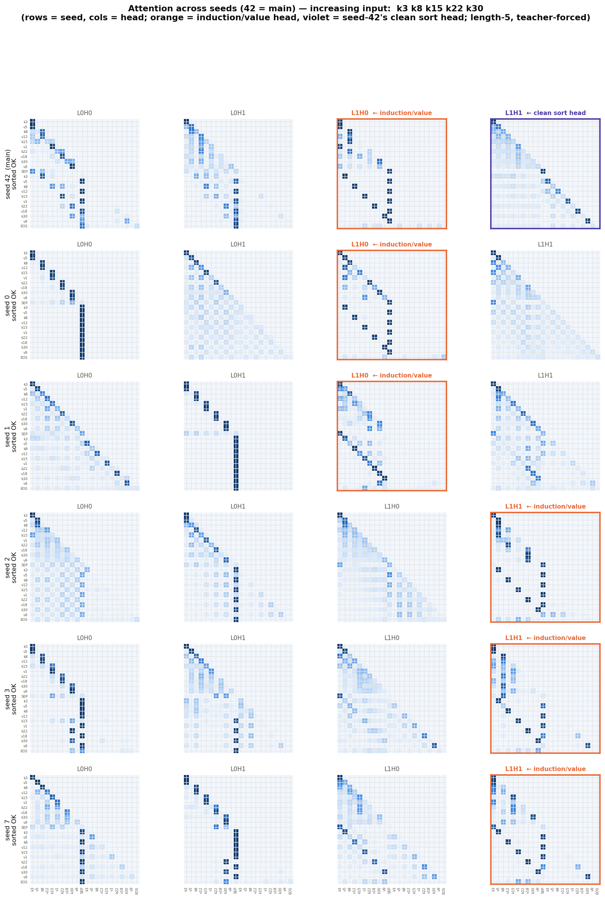
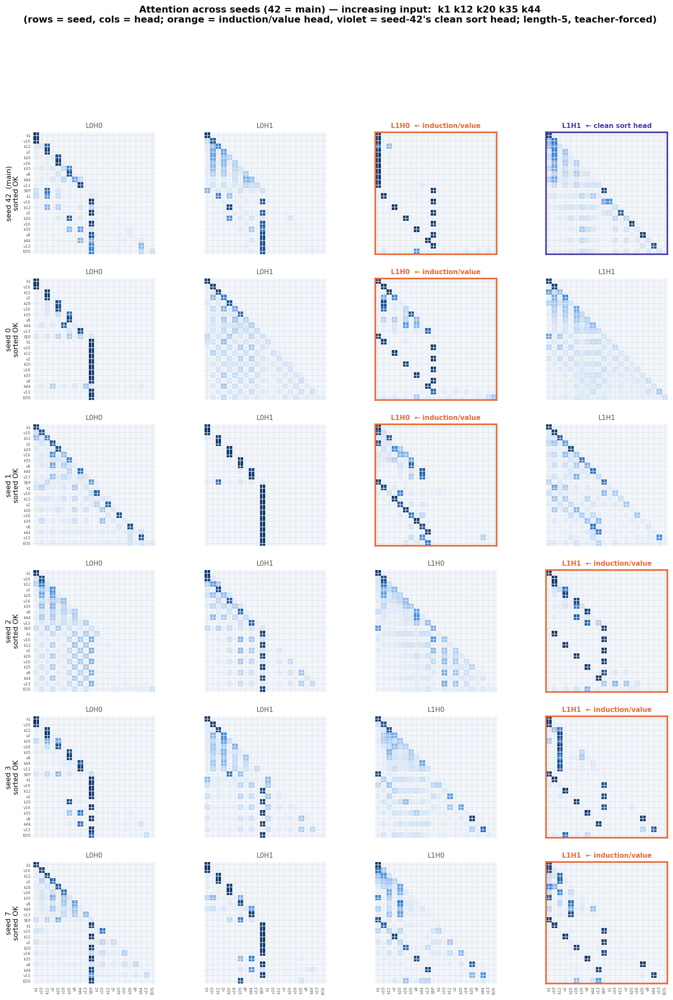
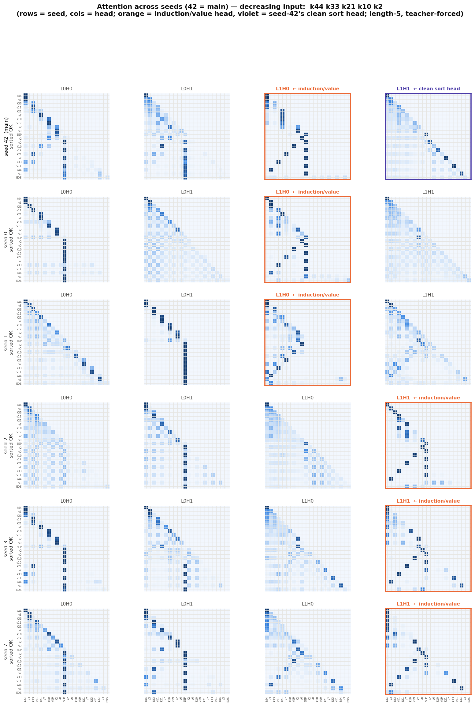
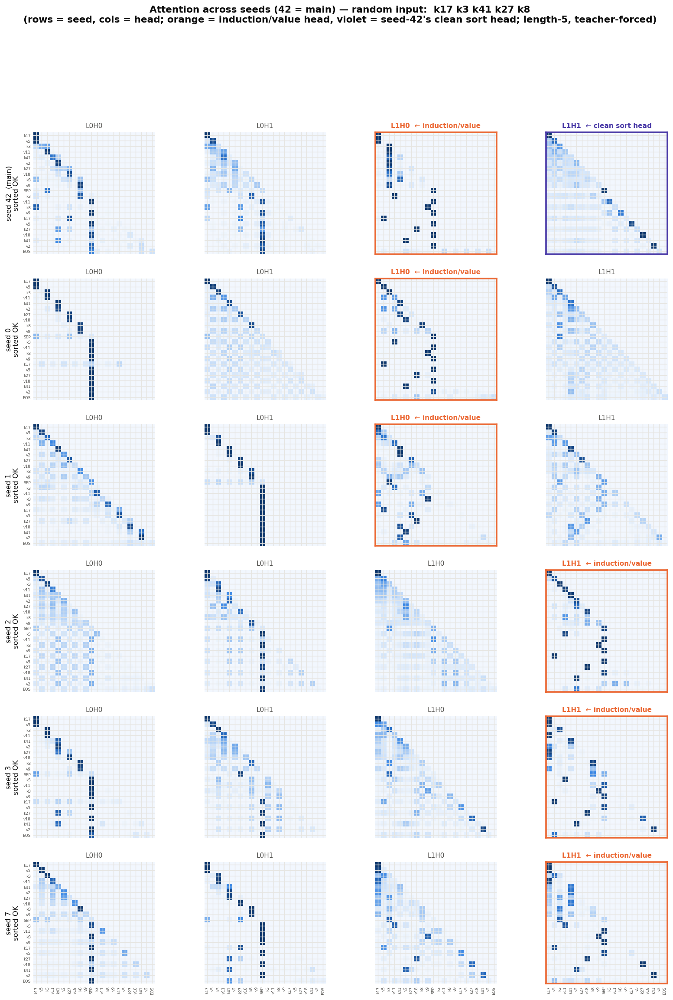
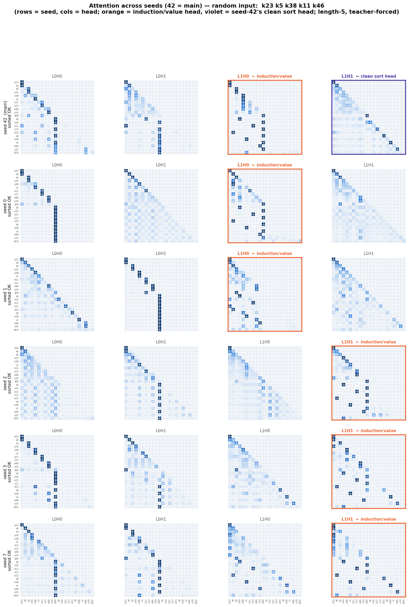
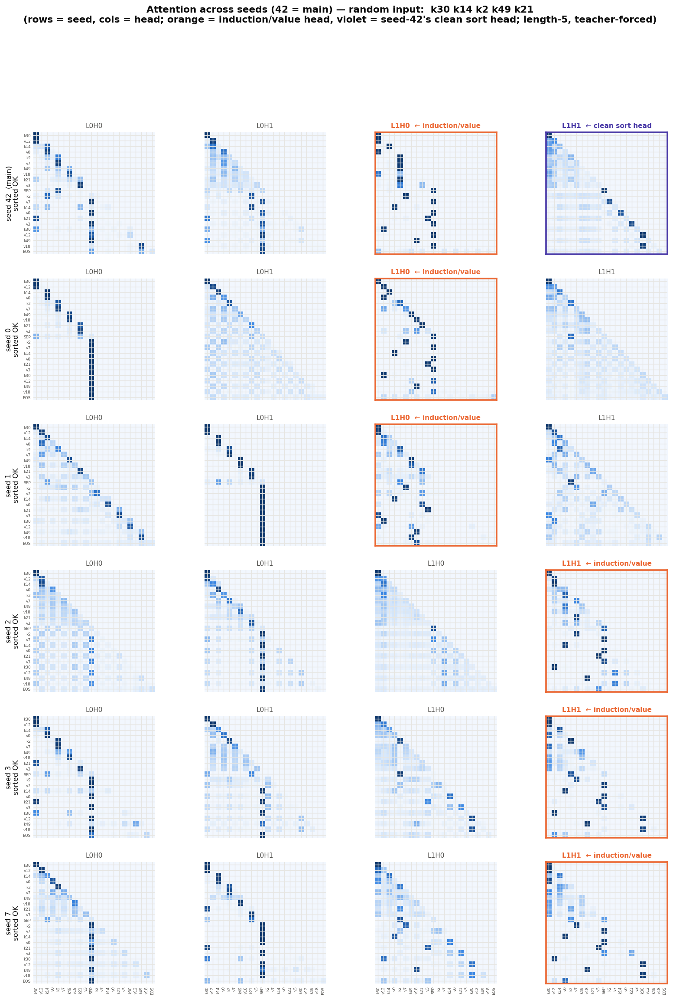

# Attention gallery: all heads, every seed, on fixed inputs

A visual companion to the universality result in
[`sort-scaling.md`](sort-scaling.md) §7. For seven hand-picked inputs — two already
**increasing**, two **decreasing** (the worst case: the output fully reverses the
input), and three **random** — it shows every attention head of **seed 42 (the main
checkpoint the whole deep study used) plus the five fresh universality seeds**
(48-wide/2-head/2-layer decoders; `sort-scaling.md` §7). Putting seed 42 on top makes
the clean-vs-diffuse contrast direct. Generated by
[`research/sort_scaling/seed_gallery.py`](../research/sort_scaling/seed_gallery.py).

## How to read

Each figure is one input. **Rows are the seeds** — seed 42 (main) first, then the
universality seeds 0, 1, 2, 3, 7; **columns are the four heads** (`L0H0 L0H1 L1H0
L1H1` by index). Each cell is that head's attention on the length-5 example,
teacher-forced on the correct sorted output; row = query position, column =
attended-to key; the layout is `k v k v k v k v k v SEP …sorted… EOS`. The
**orange-bordered column** is *that seed's* value-carrying induction head (identified
causally), which differs by seed; the **violet border** marks seed 42's clean single
sort head (`L1H1`) — the feature the other seeds lack.

What to look for:

- **The induction head permutes but keeps its shape.** The orange column is `L1H0`
  in seeds 42, 0, 1 and `L1H1` in seeds 2, 3, 7, but in every seed it is the sharp
  head whose output-region rows each point at one input **value** — the value copy.
  The scatter of those bright cells *is* the sorting permutation.
- **The sort channel is diffuse in the fresh seeds (the non-universal part).** Seed
  42's violet `L1H1` is a comparatively clean, structured sort head (a recency
  staircase reading the emitted keys); in seeds 0–7 no single non-induction head
  cleanly owns key selection — the key work is spread across the remaining heads.
  This is the "clean single sort head does not generalize" finding, made visual.
- **`SEP` is a hub.** The vertical stripe on the `SEP` column in the output-region
  rows recurs across seeds — the heads reading the compressed present-key set.
- **Input ordering barely changes the attention.** The value-copy induction pattern
  looks the same whether the input is already sorted, fully reversed, or random,
  because the routing is content-addressed (by key identity), not positional.

## Increasing inputs

The output equals the input, so the "routing" is the identity — the easy case.





## Decreasing inputs

The hardest case: every pair must move to the opposite end, so the induction scatter
is an anti-diagonal.




## Random inputs







## Reproduce

```bash
python research/sort_scaling/agent_seeds.py --train   # if the seed_*.pt are absent
python research/sort_scaling/seed_gallery.py
```
