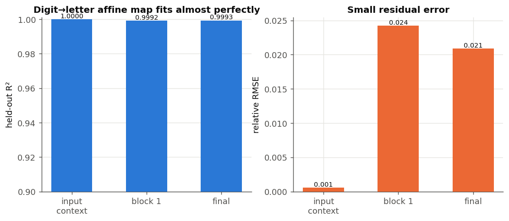
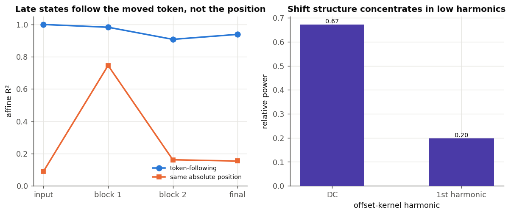

# Translation and cyclic-rotation manifolds

## Protocol

This study evaluates the supplied trained checkpoints without retraining:
`checkpoints/translate-20260711-104508.pt` (one layer, width 16) and
`checkpoints/multi_task-20260711-104631.pt` (two layers, width 32, four heads).
It uses 1,024 held-out random strings at every length. Translation uses only
`1`, `2`, `3`, `a`, `b`, and `c`; rotation uses the shared model's
`<rotate_left>` prefix. Results distinguish the raw token table from
contextual residual-stream states at matched payload positions.

## Translation: separate token table, aligned contextual manifolds

The translation checkpoint is perfect on all held-out examples at lengths 2–8.
Applying its decoded output as a new input restores the original string in 100%
of examples, directly verifying the behavioral involution.

Raw paired token embeddings are not close:

| Pair | cosine | Euclidean distance |
| --- | ---: | ---: |
| `1` / `a` | 0.026 | 5.436 |
| `2` / `b` | 0.120 | 5.701 |
| `3` / `c` | -0.241 | 5.339 |

Their mean cosine is -0.032. Centered orthogonal Procrustes alignment of the
three digit vectors to the three letter vectors has 0.241 relative error. This
is descriptive only: three paired symbols cannot establish a general linear
rule.

For each abstract string, such as `123=`, the study pairs its alternate
rendering `abc=`. An affine digit-to-letter map is fit on 75% of strings and
tested on the remaining strings. Averaged across lengths 2–8:

| State | held-out R² | cosine after map | relative RMSE |
| --- | ---: | ---: | ---: |
| Input context (token + position) | 1.0000 | 1.0000 | 0.0005 |
| After block 1 | 0.9992 | 0.9997 | 0.0242 |
| Final-normalized | 0.9993 | 0.9998 | 0.0209 |



Before mapping, paired digit/letter states are not merged: their mean cosines
are about -0.07 at input, -0.22 after the block, and -0.01 after final norm.
Thus the model retains distinct alphabets but represents their contextual
manifolds in almost linearly mutually decodable coordinate systems.

The mapping also transfers over length: training only on lengths 2–4 and
testing on 5–8 gives R² 0.983 / 0.950 / 0.980 at input / block 1 / final,
with final-state cosine 0.994. Context adds some sequence dependence at the
block, but does not destroy the substitution geometry.

## Rotation: late states follow tokens around an approximate orbit

The shared checkpoint is perfect on held-out rotate-left strings (lengths 3–8).
For each string `x`, the analysis compares the state of `x` with `R(x)`.
A token-following comparison moves each token to its rotated destination;
same-position comparison instead holds absolute position fixed.

| State | token-following affine R² | same-position affine R² |
| --- | ---: | ---: |
| Input context | 1.000 | 0.089 |
| Block 1 | 0.983 | 0.746 |
| Block 2 | 0.908 | 0.161 |
| Final-normalized | 0.939 | 0.154 |

The input result largely reflects a finite vocabulary and positional table, not
learned rotation. Block 1 still carries substantial absolute-position
information. By block 2 and final normalization, state is much better explained
by following a token to its shifted location—consistent with a late routing
stage.



A stricter centered orthogonal fit has held-out cosine 0.913 / 0.947 / 0.950
at blocks 1 / 2 / final, and relative error 0.462 / 0.377 / 0.318. Repeating
the learned one-step transform once per sequence position produces orbit closure
errors 0.378 / 0.235 / 0.217. The nonzero errors rule out an exact global linear
representation of the cyclic group; the equivariance is approximate and
content-/position-dependent.

The position-by-position cross-rotation cosine matrix is projected to its
wrapped-diagonal (circulant) component. Its residual falls from 0.475 in block
1 to 0.124 in block 2 and 0.113 final. The offset kernel concentrates most
power in DC and its first harmonic (final states roughly 0.66 and 0.18).
This supports increasingly shift-structured late geometry, but does not prove
that individual neurons are Fourier features.

## Limits and reproduction

These are observational results from one seed and fixed checkpoints, not causal
circuit localization. Affine fits are permissive on a small vocabulary; the
study therefore also uses held-out strings, cross-length transfer, orthogonal
alignment, and orbit closure.

```bash
python research/manifolds/analyze.py
```

Full per-length measurements—including translation in both directions,
involution scores, position affinities, and Fourier-power vectors—are in
`research/manifolds/results.json`.

